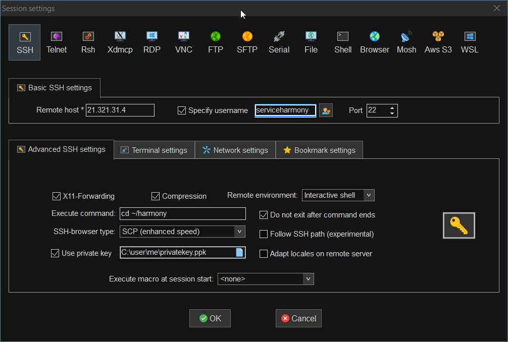

# System Administrator Tools

## Windows Applications

### Mobaxterm

[Mobaxterm](https://mobaxterm.mobatek.net/download-home-edition.html) - This is the only real tool you need to access your nodes. The other tools listed below do similar parts of what this does if it's configured properly.

Download and install Mobaxterm onto your Windows PC - Once you've loaded the application, create a new "Sessions" connection. Replace your node IP in the "Remote host" and change the username if needed. This is the initial setup we suggest for connecting to a newly created node on either [Digital Ocean or Vultr](system-administrator-tools.md).

After you've gone through our guide, setup a user account and have a folder made for your application you can change your connection to reflect these settings. Replace the username with the username you use to run your harmony application.

With your SSH-browser type set to SCP you'll also get a WinSCP style window to copy files to your node while you're viewing it in terminal.

You can also load up multiple terminals, run htop or other statistics and commands simultaneously.

We're also going to be loading up a section of scripts and macros to use to manage your system soon, stay tuned!

### VS Code

This [application for Windows or Mac](https://code.visualstudio.com/) is the text editor we use to remotely change the files on our nodes. Connects to your droplet via the same SSH key public/private pair you'll create for your user account.

Once you've downloaded and installed the application we recommend going to their Extensions section \(CTRL+SHIFT+F\) and installing the Remote Development Extension Pack.

Configure your server, user account and IdentityFile in your SSH configuration file for VS Code.

### Other Windows Utility Applications

[Ubuntu 20.04 LTS](https://www.microsoft.com/en-us/p/ubuntu-2004-lts/9n6svws3rx71?activetab=pivot:overviewtab) - If you're running Windows 10, go to the Microsoft Store and install Ubuntu 20.04 LTS. It's super helpful to use since your nodes will be Linux anyways.  
[Putty ](https://www.putty.org/)- Connection manager and key generator for SSH connections  
[WinSCP](https://winscp.net/eng/index.php) - Import connections from putty and transfer files with an explorer style interface

## Mac

Mac operators shouldn't really need many extra tools over their normal terminal. If there are any suggestions please let us know in our [telegram chat](https://t.me/easynodestaking)!

[Filezilla](https://filezilla-project.org/download.php?platform=osx) - If you would like a gui to use to transfer your BLS Keys, we recommend Filezilla on Mac.

