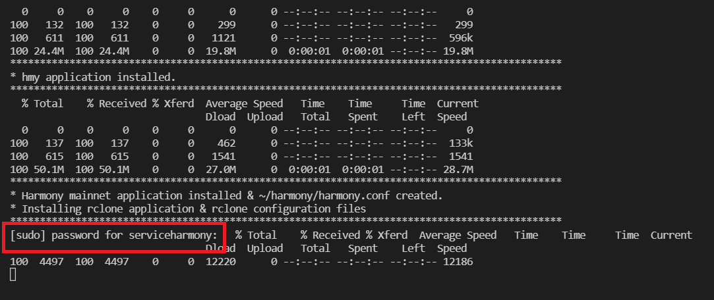

# Having problems? Here's how to reset our app and try again!
---
# Harmony Application Troubleshooting

Harmony troubleshooting is actually quite simple. Here's how we suggest getting better messages to determine your issue:

Stop your harmony service:

```text
sudo service harmony stop
```

Move to your ~/harmony folder and run harmony manually. This bypasses the service and allows for better error messages.

```text
cd ~/harmony
./harmony -c harmony.conf
```

Analyze your error message and resolve or ask in [Discord Chat](https://discord.gg/babnYCEZ7Q) about the solutions!

# Validator Toolbox Troubleshooting

For any issues with the toolbox, or if you'd like to re-run it after launch it the first time simply remove ~/.easynode.env from your server and rerun our script. That will trigger setup once again.

You can log an issues or bugs on our github page as well.

[Our repository]("https://github.com/easy-node-one/validatortoolbox")

## Common Issues During Install
If you're too good, you may try to run the installer before the user data setup completes. Just give it a moment and re-run the pip3 command.


## Requirements missing

If you get this error, you didn't run the pip3 command or it failed, try it again.


##  Sudoless Root Skipped - Application install starts and freezes up.

If your download freezes on this screen you didn't setup sudoless root properly. You can enter your user password to get it to continue or re-read the [Server Prep](../server-prep/index.html) section.



### No Module Found Error

```text
ModuleNotFoundError: No module named 'xxxxxxxxxx'
```

This error is easy, perform the following and then re-run start.py

```text
cd ~/validatortoolbox
pip3 install -r requirements.txt
```

